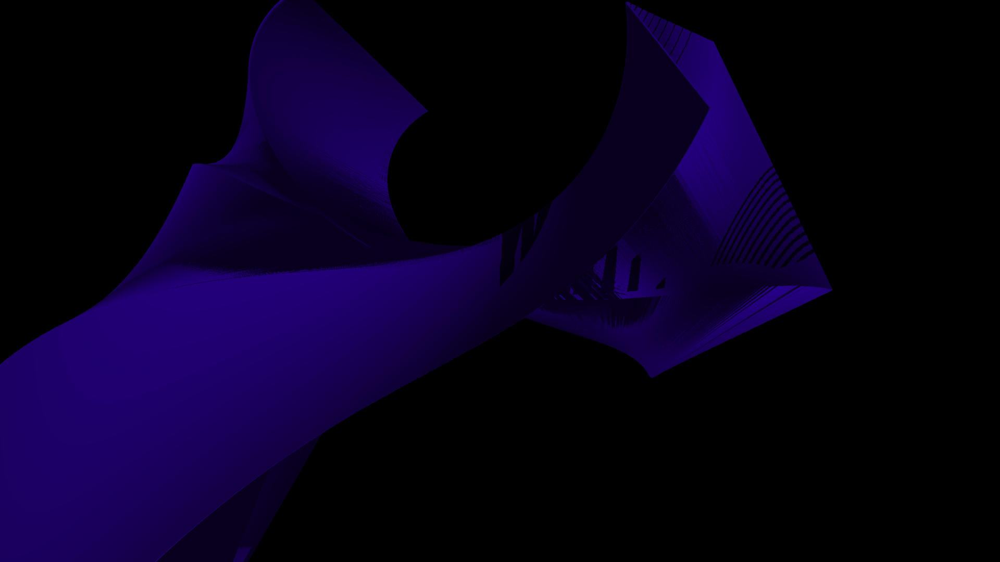

# Bezier-Based CPU Tube Renderer

A professional-grade, high-performance 3D software rendering engine written in C. This project implements a full custom graphics pipeline from scratch, optimised for CPU-bound environments. It features volumetric extrusion, multithreaded rasterisation, shadow mapping, distance-based LOD, and a configurable projection system with supersampling anti-aliasing and a full cinematic post-processing stack.

-----

## Renders Produced




-----

## Architecture Overview

The system is designed as a modular pipeline where data flows from abstract mathematical definitions to a discrete pixel grid.

  * **[`types.h`](./include/types.h)**: Defines the core data structures (`Vec3`, `Mat4`, `AABB`) and engine constants, with runtime-configurable resolutions and thread count.
  * **[`main.c`](./src/main.c)**: Command-line interface, system initialisation, and the final output supersampling/downscaling plus all post-processing effects (background, fog, ACES, vignette, DOF, bloom).
  * **[`geometry.c`](./src/geometry.c)**: Implementation of Cubic Bezier evaluation (de Casteljau) and stable reference frame generation.
  * **[`scene.c`](./src/scene.c)**: Orchestrates thread management (`pthreads`) and high-level pass logic (Shadow Pass vs. Render Pass) with dynamic thread count.
  * **[`renderer.c`](./src/renderer.c)**: The rasterisation engine, managing scan-line filling, Gouraud shading, shadow depth-testing, and LOD distance culling.
  * **[`math.c`](./src/math.c)**: Linear algebra suite including matrix multiplication, vertex transformation, and frustum culling logic.

-----

## Technical Deep-Dive & Code Walkthrough

### 1. Geometry Generation & The Bezier Logic (`geometry.c`)

The engine does not store static meshes. Instead, it extrudes geometry along a **Cubic Bezier Curve**.

A Bezier curve is defined by four control points: $$( P_0, P_1, P_2, P_3 )$$. The function `bezier_eval` calculates the 3D position at any time $$t \in [0,1]$$ using **de Casteljau's algorithm**: successive linear interpolations that are numerically stable and equivalent to evaluating the Bernstein polynomials.

```c
Vec3 bezier_eval(BezierCubic b, float t){
    float u = 1.0f - t;

    // First level of interpolation
    Vec3 a = { u*b.p0.x + t*b.p1.x, u*b.p0.y + t*b.p1.y, u*b.p0.z + t*b.p1.z };
    Vec3 c = { u*b.p1.x + t*b.p2.x, u*b.p1.y + t*b.p2.y, u*b.p1.z + t*b.p2.z };
    Vec3 d = { u*b.p2.x + t*b.p3.x, u*b.p2.y + t*b.p3.y, u*b.p2.z + t*b.p3.z };

    // Second level
    Vec3 e = { u*a.x + t*c.x, u*a.y + t*c.y, u*a.z + t*c.z };
    Vec3 f = { u*c.x + t*d.x, u*c.y + t*d.y, u*c.z + t*d.z };

    // Final point
    return (Vec3){ u*e.x + t*f.x, u*e.y + t*f.y, u*e.z + t*f.z };
}
```

To create a tube we also need an orientation. The `bezier_tangent` function computes the first derivative:

$$
B'(t) = 3(1-t)^2 (P_1-P_0) + 6(1-t)t (P_2-P_1) + 3t^2 (P_3-P_2)
$$

That tangent serves as the "forward" direction. By taking the cross product of the tangent and a chosen up-vector (with a fallback when they are parallel) we generate a **stable local coordinate frame** at every segment. A 2D circle of vertices is then rotated to be always perpendicular to the path, preventing the tube from becoming flat or twisted.

### 2. Multi-Core Threading & Job Dispatch (`scene.c`)

Because software rasterisation is computationally heavy, `scene.c` employs a **data-parallel** architecture.

The engine divides the total `tube_count` into $$N$$ equal slices, where $$N$$ is the runtime-configurable thread count (`-threads`). Each thread processes its own chunk of tubes independently.

```c
int per = scene.tube_count / num_threads;
for(int t = 0; t < num_threads; t++){
    jobs[t].start = t * per;
    jobs[t].end   = (t == num_threads-1) ? scene.tube_count : (t+1)*per;
    pthread_create(&threads[t], NULL, render_thread, &jobs[t]);
}
```

  * **Shadow Pass** - All threads render their tubes from the light's point of view into private depth buffers that are then merged into the global `shadow_map`.
  * **Render Pass** - All threads render from the camera's perspective, performing depth-tests against the shared `zbuffer` and occlusion tests against the `shadow_map`.

### 3. Frustum Culling (`math.c`)

To maintain interactive performance with millions of tubes, geometry outside the view frustum is discarded early.

Every tube is enclosed in an **Axis-Aligned Bounding Box (AABB)**. The function `aabb_in_frustum` transforms the eight corners of this box into **clip space** using the View-Projection matrix. If at least one corner falls inside the canonical clip volume $$[-1,1] \times [-1,1] \times [0,1]$$, the tube is considered potentially visible. Otherwise the thread skips it entirely, saving enormous amounts of vertex and pixel processing.

```c
int aabb_in_frustum(AABB box, Mat4 mvp){
    Vec3 corners[8] = {
        {box.min.x, box.min.y, box.min.z}, …
    };
    for(int i = 0; i < 8; i++){
        Vec4 c = mat4_mul_vec4(mvp, (Vec4){corners[i].x, corners[i].y, corners[i].z, 1.0f});
        if(c.w > 0){
            float nx = c.x/c.w, ny = c.y/c.w, nz = c.z/c.w;
            if(nx >= -1 && nx <= 1 && ny >= -1 && ny <= 1 && nz >= 0 && nz <= 1.1f)
                return 1;  // visible
        }
    }
    return 0;  // culled
}
```

### 4. Rasterisation & Shading (`renderer.c`)

Once geometry is projected to screen space, `renderer.c` fills the resulting triangles with a **scanline rasteriser**.

The engine uses **Gouraud shading**: lighting intensity is computed per vertex and then linearly interpolated across the triangle. For every pixel the pipeline performs:

1. **Z-Buffer Test** - Compare the pixel's depth against `zbuffer[y][x]`. If farther, skip.
2. **Shadow Test** - The light-space coordinates of the pixel are likewise interpolated. The interpolated depth is compared to the value in the pre-computed `shadow_map`; if the pixel lies deeper than the stored depth (with a small bias), it is in shadow and its intensity is reduced.

```c
// Inside the scanline loop for each pixel
if(depth >= zrow[x]) continue;

float intensity = …, shadow_factor = 1.0f;
if(intensity > 0.35f){
    // Interpolate light-space coordinates
    LightCoord lc = { la.x + t*(lb.x - la.x), … };
    if(lc.x >= 0.0f && lc.x <= 1.0f && lc.y >= 0.0f && lc.y <= 1.0f){
        int sxi = (int)(lc.x * (shadow_w - 1));
        int syi = (int)(lc.y * (shadow_h - 1));
        if(lc.z > shadow_map[syi * shadow_w + sxi] + 0.001f)
            intensity *= 0.25f;   // in shadow
    }
}
zrow[x] = depth;
row[x].r = (unsigned char)(intensity * cr);
// …
```

In addition, a **distance-based LOD** system inside `render_tube` dynamically reduces the segment and side counts for tubes far from the camera, trading detail for speed while preserving visual quality.

### 5. Supersampling Anti-Aliasing (SSAA) & Output (`main.c`)

The renderer draws to a high-resolution internal framebuffer (configurable via `-iw`/`-ih`). For each final output pixel, a small region of the high-res buffer is averaged using a box filter. This is equivalent to a 2x2 ordered-grid SSAA and removes jagged edges without blurring detail.

```c
// Downsampling loop
for(int y = 0; y < out_h; y++){
    for(int x = 0; x < out_w; x++){
        float u  = (x + 0.5f) / out_w, v  = (y + 0.5f) / out_h;
        float du = 0.5f / out_w,      dv = 0.5f / out_h;

        int sx0 = (int)((u-du)*render_width);  if(sx0 < 0) sx0 = 0;
        int sx1 = (int)((u+du)*render_width);  if(sx1 >= render_width)  sx1 = render_width-1;
        int sy0 = (int)((v-dv)*render_height); if(sy0 < 0) sy0 = 0;
        int sy1 = (int)((v+dv)*render_height); if(sy1 >= render_height) sy1 = render_height-1;

        int r=0, g=0, b=0, count=0;
        for(int sy = sy0; sy <= sy1; sy++)
            for(int sx = sx0; sx <= sx1; sx++){
                Pixel *p = &fb[sy * render_width + sx];
                r += p->r; g += p->g; b += p->b; count++;
            }
        unsigned char px[3] = { r/count, g/count, b/count };
        fwrite(px, 1, 3, outfile);
    }
}
```

The internal and output resolutions are independent, giving users full control over quality vs. performance. Output is supported in PPM (default) or PNG via a flag.

### 6. ACES Filmic Tone Mapping (`main.c`)

Raw linear RGB values can clip harshly in bright areas, losing detail in highlights and making the image look synthetic. The engine optionally applies an **ACES filmic tone map**, a curve that smoothly rolls off the highlights while preserving shadow detail, giving every render a cinematic, film-like quality.

The implementation uses the Narkowicz approximation to the ACES Reference Render Transform, a rational function of the form:

$$
f(x) = \frac{x \cdot (2.51\,x + 0.03)}{x \cdot (2.43\,x + 0.59) + 0.14}
$$

```c
// ACES applied per-channel as a fast post-process
float r = pixel.r / 255.0f;
r = (r * (2.51f * r + 0.03f)) / (r * (2.43f * r + 0.59f) + 0.14f);
// clamp and convert back to 8-bit
pixel.r = (unsigned char)(fmaxf(0.0f, fminf(1.0f, r)) * 255.0f);
```

#### ACES enabled


#### ACES disabled


### 7. Atmospheric Post-Processing (`main.c`)

The engine offers optional post-processing effects that are applied as fast per-pixel passes over the finished framebuffer.

* **Background Fill**: Replaces untouched pixels (sky) with a user-defined colour.
* **Exponential Depth Fog**: Simulates atmospheric scattering by blending tube colours toward a fog colour as depth increases, using `fog_factor = 1 - e^(-depth * density)`. Fog colour and density are configurable.
* **Vignette**: Darkens the image corners with a soft radial gradient, drawing the viewer's eye to the centre. Strength is adjustable.

All three are toggleable independently via the CLI.

### 8. Depth of Field (`main.c`)

A configurable depth-of-field effect blurs objects that are far from the focal plane, simulating camera lens focus. The implementation uses a pre-blurred image pyramid (full, half, quarter resolution) and bilinear sampling to produce a smooth, physically plausible blur with minimal performance impact.

### 9. Bloom (`main.c`)

Bloom adds a soft glow around bright areas. The effect downsamples the framebuffer to half resolution, thresholds to isolate bright pixels, applies a separable Gaussian blur, and then up-samples and adds the result back to the original image. Threshold, intensity, and blur width are fully controllable.

-----

## CLI Reference

### Geometry Parameters

  * `-t <int>`: Total number of tubes (default 100000).
  * `-seg <int>`: Longitudinal segments per tube. Higher -> smoother curves.
  * `-sid <int>`: Radial sides per tube. `3` = triangular, `12+` = smooth cylinder.
  * `-r <float>`: Tube radius.
  * `-scale <float>`: Global scale of the scene.

### Bezier Control Points

  * `-p0 <x,y,z>`: Origin point of the spline.
  * `-p1 <x,y,z>`: First control point (influences curve exit).
  * `-p2 <x,y,z>`: Second control point (influences curve entry).
  * `-p3 <x,y,z>`: Destination point of the spline.

### Transformations & Animation

  * `-rx, -ry, -rz <float>`: Rotation multipliers (per-tube angle step x index).
  * `-rcx, -rcy, -rcz <float>`: Constant rotation offsets.
  * `-as <float>`: Angle step - increment applied to rotation per successive tube.
  * `-tx, -ty, -tz <float>`: Global translation (world position offset).
  * `-mtx, -mty, -mtz <float>`: Translation multipliers that scale the per-index step.
  * `-ts <float>`: Translate step - linear offset per tube index, used with the multipliers.

### Camera & Lighting

  * `-cx, -cy, -cz <float>`: Camera position.
  * `-fov <float>`: Field of View in degrees.
  * `-focus <x,y,z>`: LookAt target (default 0,0,0).
  * `-lx, -ly, -lz <float>`: Point light position (affects shading and shadows).

### Shading & Output

  * `-rgb`: Enable rainbow-cycling colours based on tube index.
  * `-color <r,g,b>`: Set a static colour (e.g. `255,128,0`).
  * `-cycles <float>`: Number of full hue cycles when using `-rgb` (default 1.0).
  * `-aces`: Applies ACES filmic tone mapping.
  * `-bg <r,g,b>`: Background colour for empty pixels.
  * `-fog`: Enables exponential depth fog.
  * `-fogcolor <r,g,b>`: Fog colour (default 180,200,255).
  * `-fogdensity <float>`: Fog density (default 0.15, higher = thicker).
  * `-vignette [strength]`: Enables vignette darkening with optional strength (default 0.4).
  * `-dof`: Enables depth of field.
  * `-focal <float>`: Focal depth in NDC (0..1, default 0.5).
  * `-aperture <float>`: Blur amount for DOF (default 8.0).
  * `-bloom`: Enables bloom (glow).
  * `-bloomthreshold <float>`: Brightness threshold for bloom (0..1, default 0.7).
  * `-bloomintensity <float>`: Bloom strength (default 0.4).
  * `-threads <int>`: Number of rendering threads (default 8).
  * `-iw <int>`: Internal render width (default 3840).
  * `-ih <int>`: Internal render height (default 2160).
  * `-ow <int>`: Output image width (default 1920).
  * `-oh <int>`: Output image height (default 1080).
  * `-sw <int>`: Shadow map width (default 1024).
  * `-sh <int>`: Shadow map height (default 1024).
  * `-png`: Output as PNG instead of PPM.
  * `-o <string>`: Output filename (default `output.ppm`, or `output.png` if `-png` is used).

-----

## Build Instructions

The engine is written in standard C99 and requires a compiler with `pthread` support (POSIX threads). A Makefile is provided for convenience.

```bash
# Build the project
make

# Clean build artifacts
make clean

# Optional: Generate LSP database for IDE support (requires 'bear')
bear -- make
```

**Compile Flags Explained:**

  * `-O3`: Maximum optimisation.
  * `-march=native`: Utilises all instruction-set extensions of your CPU (AVX, SSE, etc.).
  * `-ffast-math`: Relaxes IEEE floating-point compliance for extra speed.
  * `-flto`: Link-time optimisation for cross-file inlining.
  * `-pthread`: Links the POSIX threads library.

-----

## License

This source code is provided as an open-source reference for high-performance software rendering techniques.
```
